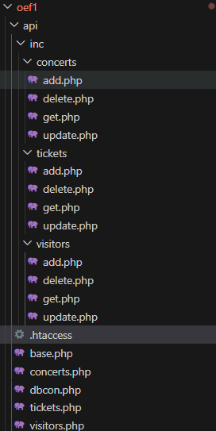
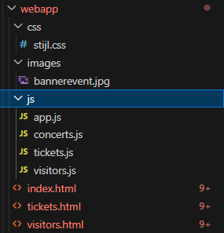
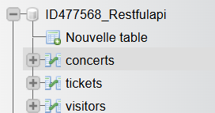

Naam: RESTful API – Concert Tickets
Student: Mohamed Amine Hssinoui
Opleiding: Toegepaste Informatica – Odisee Hogeschool
Vak: Web & Mobile
Live Webapplicatie: https://www.mohamedaminehssinoui-odisee.be/oef1/webapp/

2. Technische Structuur
API Architectuur (/api/)

front end structuur 

Database Structuur
De MySQL-database (ID477568_Restfulapi)
 bevat drie kerntabellen die de many-to-many relatie tussen bezoekers en concerten mogelijk maken:

concerts (id, artist, date, time, venue, price)

visitors (id, first_name, last_name, birth_date, email)

tickets (id, visitor_id, concert_id, qty)

3. API Endpoints & Postman Tests
Hieronder staan nieuwe, gevarieerde voorbeelden om de API met Postman te testen.

Concerts API
Endpoint: https://www.mohamedaminehssinoui-odisee.be/oef1/api/concerts.php
get , post , put , delete 

Visitors API
Endpoint: https://www.mohamedaminehssinoui-odisee.be/oef1/api/visitors.php
get , post , put , delete 

Tickets API
Endpoint: https://www.mohamedaminehssinoui-odisee.be/oef1/api/tickets.php

4. Werkplanning & Projectafwerking
Datum	Activiteit
Za 04/10	Opzetten van de database-structuur op Combell en configuratie van de connectie (dbcon.php).
Zo 05/10	Implementatie van de concerts.php router en succesvol testen van alle GET-requests via Postman.
Ma 06/10	Ontwikkeling van de POST-functionaliteit (add.php) voor alle endpoints.
Di 07/10	Implementatie en testen van de PUT-methodes (update.php) om gegevens te kunnen wijzigen.
Wo 08/10	Afronden van de API met DELETE-functionaliteit en het voltooien van de volledige CRUD-cyclus voor concerts, visitors en tickets. Alle endpoints werden succesvol gevalideerd met Postman.

Fase 2: Front-end Webapplicatie (5 dagen: 07/10 - 12/10)
Gedurende vijf dagen werd de webapplicatie ontwikkeld met HTML, CSS  JavaScript.

Structuur: De HTML-bestanden (index.html, visitors.html, tickets.html) 

Styling: Een eerste versie van de stijl.css werd geschreven om de lay-out en het design vorm te geven.

Logica: De kern van het werk lag in de JavaScript-bestanden. 
Hier werd de logica geschreven om via fetch (met async/await) te communiceren met de API,
 de JSON-data te verwerken en de pagina's dynamisch op te bouwen.

 Oké, perfect begrepen. Je wilt de "Werkplanning" in je README.md aanpassen zodat het de werkelijke tijdsindeling van je project beter reflecteert: 5 dagen voor de API, 5 dagen voor de front-end, en de laatste 3 dagen voor de afwerking.

Hier is de geüpdatete en meer gedetailleerde sectie voor je README.md. Dit vervangt de oude "Werkplanning" en de "Afronding" secties.

Je kunt dit direct kopiëren en in je oef1/README.md plakken.

4. Werkplanning en Projectontwikkeling
Het project werd in drie duidelijke fasen ontwikkeld over een periode van bijna twee weken, wat een realistische en grondige aanpak van het ontwikkelingsproces weerspiegelt.

Fase 1: Back-end API Ontwikkeling (5 dagen: 04/10 - 08/10)
De eerste vijf dagen waren volledig gewijd aan het bouwen en testen van de RESTful API. Het doel was om een solide en betrouwbare back-end te hebben voordat de ontwikkeling van de interface begon.

Datum	Activiteit
Za 04/10	Opzetten van de database-structuur op Combell en configuratie van de connectie (dbcon.php).
Zo 05/10	Implementatie van de concerts.php router en succesvol testen van alle GET-requests via Postman.
Ma 06/10	Ontwikkeling van de POST-functionaliteit (add.php) voor alle endpoints.
Di 07/10	Implementatie en testen van de PUT-methodes (update.php) om gegevens te kunnen wijzigen.
Wo 08/10	Afronden van de API met DELETE-functionaliteit en het voltooien van de volledige CRUD-cyclus voor concerts, visitors en tickets. Alle endpoints werden succesvol gevalideerd met Postman.

Exporter vers Sheets
Fase 2: Front-end Webapplicatie (5 dagen: 09/10 - 13/10)
Nadat de API was afgerond, verschoof de focus naar het bouwen van de gebruikersinterface. Gedurende vijf dagen werd de webapplicatie ontwikkeld met HTML, CSS en modern JavaScript.

Structuur: De HTML-bestanden (index.html, visitors.html, tickets.html) werden opgezet.

Styling: Een eerste versie van de stijl.css werd geschreven om de lay-out en het design vorm te geven.

Logica: De kern van het werk lag in de JavaScript-bestanden. Hier werd de logica geschreven om via fetch (met async/await) te communiceren met de API, de JSON-data te verwerken en de pagina's dynamisch op te bouwen.

Fase 3: Afwerking en Kwaliteitsverbetering (3 dagen: 09/10 - 12/10)
De laatste drie dagen waren cruciaal voor het afleveren  De focus lag op:

Code Refactoring: Zowel de PHP als de JavaScript-code werd grondig nagelezen en opgeschoond. 
Dubbele code werd verwijderd en de structuur werd geoptimaliseerd voor betere leesbaarheid.

Documentatie: De README.md werd gedetailleerd uitgewerkt 

Styling & UX: De CSS werd verder verfijnd voor een betere en consistentere gebruikerservaring op alle pagina's.

Finale Tests: van mijn api met postman om te zien als alles nog goed werk 